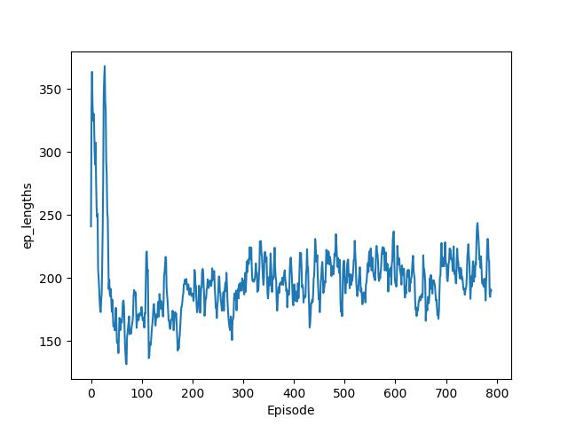
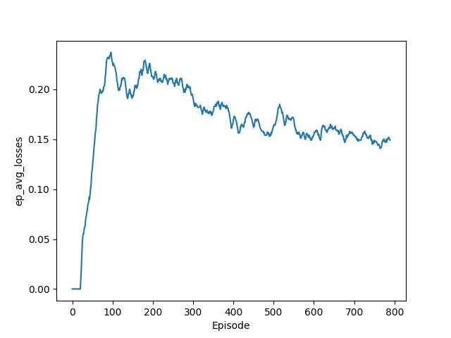
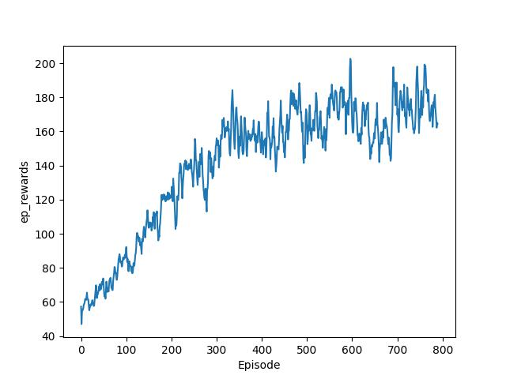
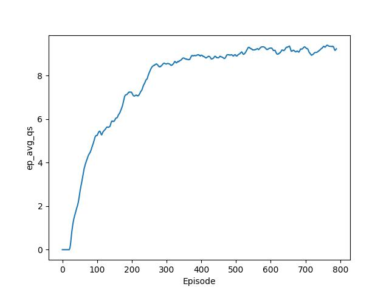

# Double DQN: Super Mario Bros.

This project is built based on the paper regarding <b>Double DQN</b> [[1]](#1)
and official **PyTorch** website [[2]](#2).<br>
The main motivation and purpose of building this project was to enhance the better understanding of how reinforcement learning works on practice through code.
Here, the code applies DDQN which is quite similar to DQN [[3]](#3).
For further information regarding the difference between the two, please see the following: [Background](#background) or [[1]](#1).

## Showcase


## To Get Started

```zsh
git clone git@github.com:3seoksw/DDQN-mario.git
```

In order to properly run the code, first clone the repository.<br>
And create new virtual environment using the `requirements.txt`. Here, I'm using `conda`.<br>

```zsh
conda create --name <your-env> --file requirements.txt
conda activate <your-env>
```

After setting up the virtual environment and the code, run `main.py`.<br>

**Note**: [nes-py 8.2.1](https://pypi.org/project/nes-py/) (from [gym-super-mario-bros 7.4.0](https://pypi.org/project/gym-super-mario-bros/)) and
[gym 0.26.0](https://gymnasium.farama.org/content/migration-guide/) are not compatible.
There is a difference in `reset()` function's signature between two packages.<br>
There are few workarounds but I erased every `truncated` keyword in `time_limit.py` from imported package directory.

## Problem Justification

Because the project is using several packages, explicit (manual) definition or assignment of
$\text{Environment, State, Action, Reward}$ is not necessary.<br>
But for the sake of understanding of RL, you might want to see [[3]](#3) which provides detailed explanations on solving Atari games using RL.<br>

The following explains how problem can be justified in a simple manner:

$$
\begin{align*}
    \text{Environment}: &\text{the world agent interacts with} \\
    & \textit{i.e.} \text{) stage, blocks, mushrooms, } \textit{etc.} \\
    \text{State}: &\text{current image frame} (\text{channel} \times \text{height} \times \text{width}) \\
    \text{Action}: &\text{set of actions agent Mario can take} \\
    & \text{\textit{e.g.}) move forward, jump, \textit{etc.}} \\
    \text{Reward}: &\text{distance agent moved} \\
    &\text{coins agent acquired} \\
    &\text{enemies agent killed} \\
    &\text{time consumed} \\
    &\text{reached to the final flag (terminal state)} \\
    &\textit{etc.} \\
\end{align*}
$$

Main goal is to agent maximizing its rewards.

Since states are in the forms of image frames, CNN will be used which consists of three convolutional layers paired with ReLU function, flattening layer, densifying the tensor processed, and two fully-connected neural networks.<br>
Agent will judge the current situation using the state information

Actions can vary (right-only, simple, or complex) according to [nes-py 8.2.1](https://pypi.org/project/nes-py/).
Agent will choose an action based on the algorithm namely DDQN in order to maximize the reward.

Rewards are the key to solve RL problems. Agent will take actions based on the rewards.
Here, rewards can be whether the agent reached to final state (flag), the distance agent moved, etc.

## Background

There are some similarities between DQN and Double DQN (DDQN) in terms of both taking advantage of using $Q$ values.
But there is a major difference for the method to update $Q$ value.
For further reference, please see [[1]](#1).

### DQN

In $Q$-learning, objective is to find optimal $Q$ value which is parameterized by $\theta$.
The $Q$-learning update requires some action $A_t$, state $S_t$, and reward $R_{t+1}$,
then we can get:

```math
\begin{aligned}
    \theta_{t+1} &= \theta_t + \alpha(Y^{Q}_t - Q(S_t, A_t; \theta_t))
    \nabla_{\theta_t}Q(S_t, A_t; \theta_t)
\end{aligned}
```

where $\alpha$ is a step size. And the target $Y_t^Q$ is defined as:

```math
\begin{aligned}
    Y_t^Q \equiv R_{t+1} + \gamma \text{max}_aQ(S_{t+1}, a; \theta_t) \\
    Y^Q_t \approx Q(S_t, A_t; \theta_t)
\end{aligned}
```

However, the target value can cause overestimation. Therefore, DDQN is proposed.

### Double DQN

While applying the same fundamental foundations from DQN, experience replay and target network, DDQN uses two separate $Q$-networks;
online network which is for selecting the best action
and target network which is for evaluating the action.
You can simply think DDQN is separating DQN's target network into two.

The target is as follows:

```math
\begin{aligned}
    Y_t^{\text{DQN}} \equiv R_{t+1} + \gamma \text{max}_a Q(S_{t+1}, a; \theta_t^{-})
\end{aligned}
```

where $\theta^{-}$ is a vector parameters of target network. And the Double $Q$-learning error can be written as follows:

```math
\begin{aligned}
    Y_t^{\text{DoubleQ}} \equiv R_{t+1} + \gamma Q_{\text{eval}}^{\text{target}}(S_{t+1},
    \text{argmax}_a Q_{\text{select}}^{\text{online}}(S_{t+1}, a; \theta_t); \theta_t^{-}
)
\end{aligned}
```

where $\theta$ is parameterizing online network.

## Experiment Results

<table>
    <tr>
        <td>
            
            <div align="center">Time consumed per episode</div>
        </td>
        <td>
            
            <div align="center">Decreasing losses of TD-error</div>
        </td>
    </tr>
    <tr>
        <td>
            
            <div align="center">Increasing cumulative rewards</div>
        </td>
        <td>
            
            <div align="center">Increasing average Q-values</div>
        </td>
    </tr>
</table>

## References

<a id="1" href="https://ojs.aaai.org/index.php/AAAI/article/view/10295">[1]</a>
H. v. Hasselt, A. Guez, and D. Silver. "Deep Reinforcement Learning with Double Q-learning,"
<i>Proceedings of the AAAI Conference on Artificial Intelligence, 30(1)</i>, 2016.

<a id="2" href="https://pytorch.org/tutorials/intermediate/mario_rl_tutorial.html">[2]</a>
Y. Feng, S. Subramanian, H. Wang, and S. Guo. "TRAIN A MARIO-PLAYING RL AGENT,"
PyTorch, accessed January 27, 2024,
https://pytorch.org/tutorials/intermediate/mario_rl_tutorial.html.

<a id="3" href="https://arxiv.org/abs/1312.5602">[3]</a>
V. Mnih, K. Kavukcuoglu, D. Silver, A. Graves, I. Antonoglou, D. Wierstra, and M. Riedmiller.
"Playing atari with deep reinforcement learning."
<i>arXiv preprint arXiv:1312.5602</i>, (2013).
